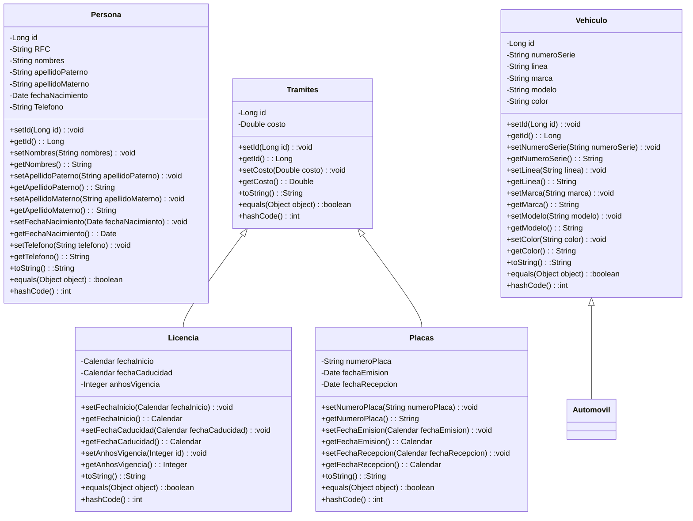

```mermaid
classDiagram


class Persona{
    -Long id
    -String RFC
    -String nombres
    -String apellidoPaterno
    -String apellidoMaterno
    -Date fechaNacimiento
    -String Telefono
    
    +setId(Long id):void
    +getId(): Long
    +setNombres(String nombres):void
    +getNombres(): String
    +setApellidoPaterno(String apellidoPaterno):void
    +getApellidoPaterno(): String
    +setApellidoMaterno(String apellidoMaterno):void
    +getApellidoMaterno(): String
    +setFechaNacimiento(Date fechaNacimiento):void
    +getFechaNacimiento(): Date
    +setTelefono(String telefono):void
    +getTelefono(): String

    +toString():String
    +equals(Object object):boolean
    +hashCode():int
}

class Tramites{
    -Long id
    -Double costo

    +setId(Long id):void
    +getId(): Long
    +setCosto(Double costo):void
    +getCosto(): Double

    +toString():String
    +equals(Object object):boolean
    +hashCode():int
}

class Licencia{
    -Calendar fechaInicio
    -Calendar fechaCaducidad
    -Integer anhosVigencia

    +setFechaInicio(Calendar fechaInicio):void
    +getFechaInicio(): Calendar
    +setFechaCaducidad(Calendar fechaCaducidad):void
    +getFechaCaducidad(): Calendar
    +setAnhosVigencia(Integer id):void
    +getAnhosVigencia(): Integer

    +toString():String
    +equals(Object object):boolean
    +hashCode():int
}

class Placas{
    -String numeroPlaca
    -Date fechaEmision
    -Date fechaRecepcion

    +setNumeroPlaca(String numeroPlaca):void
    +getNumeroPlaca(): String
    +setFechaEmision(Calendar fechaEmision):void
    +getFechaEmision(): Calendar
    +setFechaRecepcion(Calendar fechaRecepcion):void
    +getFechaRecepcion(): Calendar

    +toString():String
    +equals(Object object):boolean
    +hashCode():int
}

class Vehiculo{
    -Long id
    -String numeroSerie
    -String linea
    -String marca
    -String modelo
    -String color

    +setId(Long id):void
    +getId(): Long
    +setNumeroSerie(String numeroSerie):void
    +getNumeroSerie(): String
    +setLinea(String linea):void
    +getLinea(): String
    +setMarca(String marca):void
    +getMarca(): String
    +setModelo(String modelo):void
    +getModelo(): String
    +setColor(String color):void
    +getColor(): String

    +toString():String
    +equals(Object object):boolean
    +hashCode():int
}

class Automovil

%% Relaciones
Vehiculo <|-- Automovil


Tramites <|-- Licencia
Tramites <|-- Placas

```