# Propuesta 1 Diagrama de Clases

```mermaid
classDiagram

%% Relaciones
Vehiculo <|-- Automovil


Tramite <|-- TramiteLicencia
Tramite <|-- TramitePlacas

Requisitos <|-- RequisitosLicencia
Requisitos <|-- RequisitosPlacas



class Vehiculo{
    -Long id
    -Persona duenho
    -boolean isNuevo
}

class Automovil{
    -String noSerie
    -String-Enum marca
    -String-Enum linea
    -String-Enum color
    -String modelo
}


class Tramite{
    -Long id
    -List~Requisitos~ requisitos
}
class TramitePlacas
class TramiteLicencia

class Requisitos{
    -Long id
}
class ConstructorRequisitosX
class RequisitosPlacas
class RequisitosLicencia

class Usuario{
    -Long id
    -String usuario
    -String password
}
class Persona{
    -Long id
    -String RFC
    -String nombres
    -String apellidoPaterno
    -String apellidoMaterno
    -Date fechaNacimiento
    -Telefono telefono?
}

class Telefono{
    +crearTelefono():String
}
class Placa{
    -Long id
    -String NoPlaca
    -Vehiculo vehiculo
    -Date fechaRecepcion
    -Date fechaEmision
    -Date fechaExpiracion
    -boolean isActiva
}
class Licencia{
    -Long id
    -
}

class CostosLicencia{
    <<Enumeration>> 
    +int UN_ANHO_NORMAL
    +int UN_ANHO_DISCAPACITADO
    +int DOS_ANHOS_NORMAL
    +int DOS_ANHOS_DISCAPACITADO
    +int TRES_ANHOS_NORMAL
    +int TRES_ANHO_DISCAPACITADO
} 

class CostoPlacas{
    <<Enumeration>>
    +int PLACA_AUTO_NUEVO
    +int PLACA_AUTO_USADO
}

class Reporte{
    Long id
    Date fechaTramite
    TipoTramite tipoTramite
    Persona tramitante
    Double costo
}

class BuscadorDeReportes{
    buscarPorPeriodo(Periodo periodo):List~Persona~
    buscarPorTipoTramite(TipoTramite tipoTramite):List~Persona~
    buscarPorNombre(String nombre):List~Persona~   
}

class ConstructorReportesPDF{
    crearReportePDF(Reporte reporte):ReportePDF
}
class ReportePDF{
    Reporte reporteBase
    String titulo
    Date fechaGeneracion
    Integer cantidadPaginas
}



class Periodo{
    Date fechaInicio
    Date fechaFin
}

class TipoTramite{
    <<Enumeration>>
    EXPEDICION_PLACAS
    EXPEDICION_LICENCIA
}


```




### NOTAS
- El avance es clases de dominio, pero decidí hacer propuesta de clases para tener una mejor idea del sistema.
- CostosLicencias será un enumerador con números definidos según una matriz que represente la tabla de costos licencia, apuntando al valor correspondiente. Esto puede cambiar.
  - Otra alternativa podría ser:
  ```java
    DuracionLicencia{
        -Un año
        ...
    }
    
    TipoLicencia{
        -Normal
        -Discapacitado
    }
    

    CotizarCostoLicencia{
        calcularPrecioLicencia(TipoLicencia, DuracionLicencia):Integer
    }

    CotizarCostoPlacas{
        calcularPrecioPlacas(Vehiculo)
    }
    
  ```
- No me queda claro la fecha de recepción